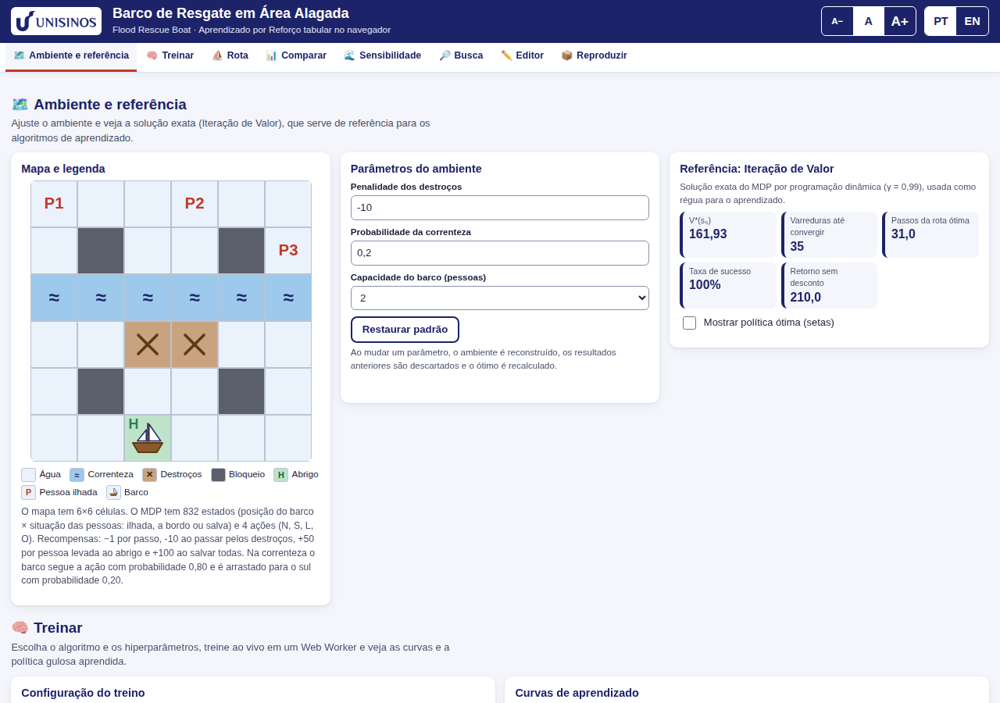
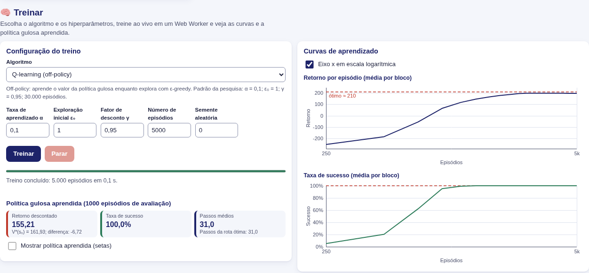
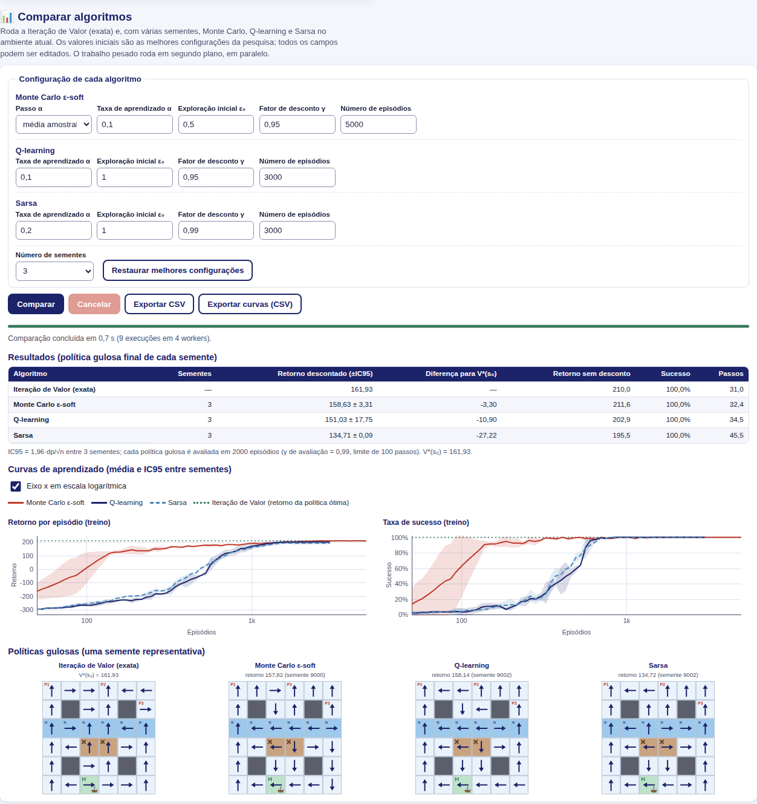
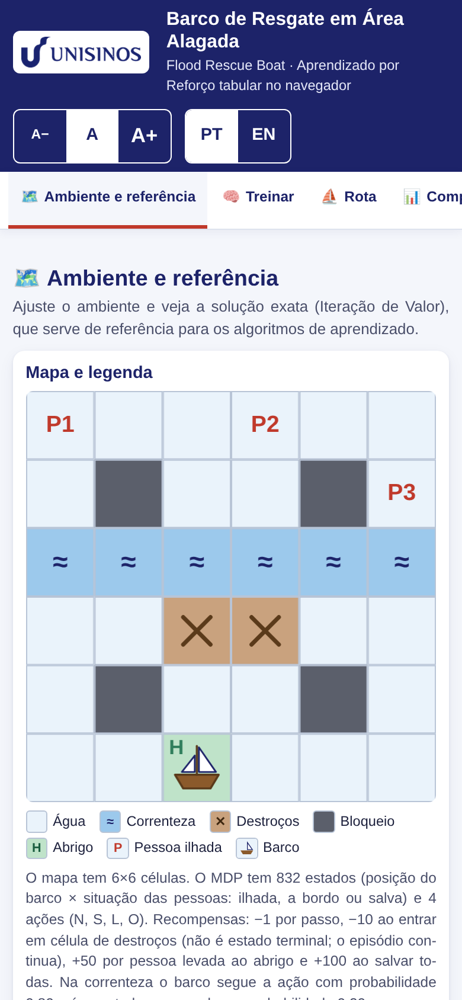
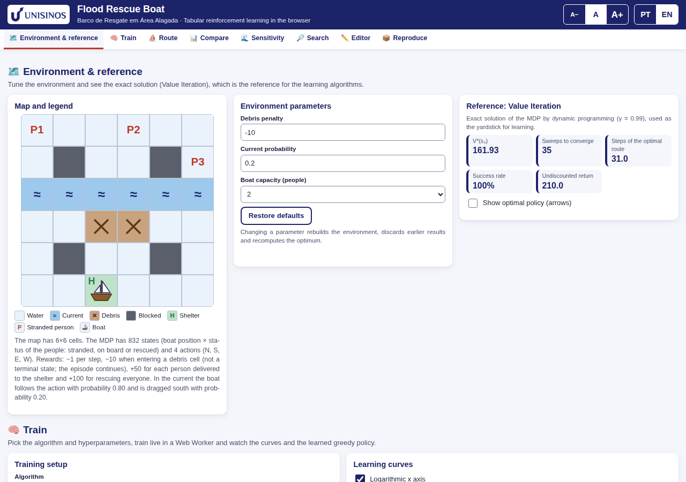

<p align="center"></p>

# Barco de Resgate em Área Alagada · Flood Rescue Boat (RL)

**🇧🇷 Português** · [🇬🇧 English below](#english)

[](https://github.com/epineto/rescue-boat-rl-unisinos/actions/workflows/test.yml)
[](LICENSE)

**Demonstração: <https://epineto.github.io/rescue-boat-rl-unisinos/>**



## O que é
Aplicação web interativa (100% no navegador, sem instalar nada, sem dependências e sem build) que reproduz os experimentos do **Trabalho 2 de Aprendizado por Reforço 2026/2** (PPGCA/Unisinos): um barco precisa resgatar 3 pessoas em um mapa 6×6 com correnteza e destroços, modelado como um MDP com 832 estados e resolvido com algoritmos tabulares (Iteração de Valor e de Política, Monte Carlo ε-soft, Q-learning e Sarsa). O núcleo (`src/env.js`, `src/algos.js`, `src/rng.js`) é uma tradução fiel do código Python do notebook e é verificado contra ele nos testes.

O idioma padrão é o português (pt-BR); o botão **EN** no topo troca para inglês (a escolha fica salva no navegador). Campos numéricos aceitam vírgula ou ponto decimal.

## Como rodar localmente
O app é estático (JavaScript ES modules), mas precisa de um servidor HTTP:

```bash
npm run serve            # equivale a: python3 -m http.server 8000
# abra http://localhost:8000
```

> Abrir `index.html` por `file://` **não funciona**: navegadores bloqueiam módulos ES e Web Workers nesse modo.

O GitHub Pages publica a **raiz** do repositório (todos os caminhos são relativos).

## Testes
```bash
npm test                 # node --test tests/  (Node >= 18; sem dependências)
```
Os testes cobrem o núcleo contra os valores do Python (`tests/reference.json`, gerado por `reference/python/gen_reference.py`), as estatísticas de várias sementes, a lógica de sensibilidade/busca, a validação do mapa, o link compartilhável, o gerador de `.zip` e a leitura de números. A integração contínua (`.github/workflows/test.yml`) roda `npm test` com Node 20 a cada push.

## O que a aplicação faz
A página tem uma barra de seções fixa no topo:

| Seção | O que faz |
|---|---|
| **Ambiente e referência** | Mapa, legenda, parâmetros (penalidade dos destroços, aplicada ao entrar em célula de destroços; não é estado terminal, correnteza, capacidade) e a Iteração de Valor exata: V*(s₀), varreduras, rota ótima e setas da política. |
| **Treinar** | Q-learning, Sarsa, Monte Carlo ε-soft (média amostral ou α constante) e Iteração de Política. Treino ao vivo em Web Worker, com progresso, curvas e botão Parar. |
| **Rota** | Animação passo a passo da política ótima ou da aprendida (semente, velocidade, Passo, Reiniciar), com registro de eventos. Com `prefers-reduced-motion` não há animação contínua. |
| **Comparar** | Iteração de Valor + Monte Carlo + Q-learning + Sarsa com 3 a 20 sementes em um *pool* de Web Workers (`navigator.hardwareConcurrency`, máx. 8): tabela (±IC95), curvas com faixas de IC, mini-mapas das políticas e CSV. |
| **Sensibilidade** | Variação da penalidade dos destroços (−10, −15, −20, −30, −60): V*(s₀), passos em destroços e na correnteza, ponto em que a rota ótima muda, gráficos e CSV. |
| **Busca** | Grade de hiperparâmetros editável (66 configurações × 10 sementes por padrão), tabela ordenável, melhor de cada algoritmo, aplicar ao cartão Treinar e CSVs. |
| **Editor** | Editor de mapa (4×4 a 8×8) com validação (um abrigo, 1 a 3 pessoas, alcançabilidade) e |S| ao vivo. |
| **Reproduzir** | Executa Comparação + Sensibilidade + Busca da pesquisa em sequência e baixa um `.zip` com os CSVs; materiais (notebook) e link compartilhável `#cfg=…` da configuração. |

Todo trabalho pesado roda em Web Workers, com progresso, tempo restante estimado e **Cancelar**; cancelar ou trocar um parâmetro encerra os workers.




<p align="center"></p>

## Estrutura de pastas
```
index.html, style.css, 404.html, manifest.webmanifest   página, estilos, páginas auxiliares
assets/                 logo, favicon (SVG), ícones e imagem de pré-visualização
src/env.js, algos.js, rng.js         núcleo (reproduz o Python)
src/experimentos.js     várias sementes, média, desvio, IC95, configurações da pesquisa
src/pesquisa.js         sensibilidade e busca de hiperparâmetros
src/validacao.js        regras do editor de mapa
src/compartilhar.js     link #cfg=… (JSON versionado em base64url)
src/animacao.js         episódio passo a passo (rota)
src/numeros.js          leitura/formatação de números (vírgula decimal)
src/pool.js, worker.js  pool de Web Workers e tarefas
src/i18n/               dicionários pt e en (mesmas chaves)
src/ui/                 interface: app, mapa, gráficos, tabelas/CSV, editor, executor...
tests/                  testes (npm test)
reference/python/       código Python de referência e gerador do reference.json
docs/                   REPRODUCAO.md, REPRODUCTION.md e imagens
```

## Mapeamento pesquisa → aplicação
Resumo (detalhes e valores esperados em [`docs/REPRODUCAO.md`](docs/REPRODUCAO.md)):

| Relatório | Na aplicação |
|---|---|
| Figura 1 (mapa e rota ótima) | Seções **Ambiente e referência** e **Rota** |
| Tabela 1 (busca de hiperparâmetros e resultado final) | Seções **Busca** e **Comparar** |
| Figura 2 (curvas de aprendizado) | **Comparar** → curvas |
| Figura 3 (sensibilidade à penalidade) | **Sensibilidade** |
| V*(s₀) = 161,93 | **Ambiente e referência** → Iteração de Valor |

Valores de referência: V*(s₀) = 161,93 (γ = 0,99); Q-learning (α = 0,1; ε₀ = 1; γ = 0,95; 30.000 ep.) 161,92 ± 0,03; Sarsa (α = 0,2; ε₀ = 1; γ = 0,99) 161,74 ± 0,26; Monte Carlo (média amostral; ε₀ = 0,5; γ = 0,95; 60.000 ep.) 159,76 ± 0,86; a rota ótima muda entre as penalidades −10 e −15.

## Limites conhecidos
- Não há garantia de números idênticos ao relatório em todas as colunas: o relatório usa um simulador em Numba e sementes do NumPy; o app usa o gerador mulberry32 de `src/rng.js`. Os resultados são equivalentes estatisticamente (dentro dos IC95), não bit a bit. O núcleo determinístico (V*, política ótima, modelo P) coincide exatamente.
- Reproduzir toda a pesquisa leva alguns minutos e depende do número de núcleos do computador.
- Funciona em navegadores modernos com Web Workers e módulos ES; não funciona por `file://`.
- Tema escuro não implementado (a página usa sempre o tema claro).
- O editor aceita mapas quadrados de 4×4 a 8×8 com no máximo 3 pessoas.

## Materiais
- Notebook (Google Colab, público): <https://drive.google.com/file/d/1USXmX9e0h3yvlcMSEU0GcgKP6sRh2YRU/view>
- Código de referência em Python: [`reference/python/rescue_boat_rl.py`](reference/python/rescue_boat_rl.py)
- Vídeo de apresentação (YouTube): https://youtu.be/BPthN4Pvb9M
- Relatório: será adicionado aqui quando publicado.

## Créditos
**Autores:** Epitácio Vicente do Nascimento Neto · Antonio Clerton Santana de Araujo — Programa de Pós-Graduação em Computação Aplicada (PPGCA), Unisinos. **Professor:** Gabriel de Oliveira Ramos. Para citar, veja [`CITATION.cff`](CITATION.cff).

## Licença
[MIT](LICENSE)

---

<a id="english"></a>
# Flood Rescue Boat (RL) — English

**Demo: <https://epineto.github.io/rescue-boat-rl-unisinos/>** (click **EN** in the header)



## What it is
An interactive web app (100% in the browser; nothing to install, no dependencies, no build) that replicates the experiments of **Reinforcement Learning Assignment 2 (2026/2)** at PPGCA/Unisinos: a boat must rescue 3 people on a 6×6 map with a current and debris, modelled as an MDP with 832 states and solved with tabular algorithms (Value and Policy Iteration, ε-soft Monte Carlo, Q-learning and Sarsa). The core (`src/env.js`, `src/algos.js`, `src/rng.js`) is a faithful port of the notebook's Python code and is tested against it. The default language is Portuguese (pt-BR). Numeric fields accept a decimal comma or dot.

## Running locally
The app is static (ES modules) but needs an HTTP server:

```bash
npm run serve            # same as: python3 -m http.server 8000
# open http://localhost:8000
```

> Opening `index.html` via `file://` does **not** work: browsers block ES modules and Web Workers in that mode.

GitHub Pages publishes the repository **root** (all paths are relative).

## Tests
```bash
npm test                 # node --test tests/  (Node >= 18; no dependencies)
```
Tests cover the core against the Python values (`tests/reference.json`, generated by `reference/python/gen_reference.py`), multi-seed statistics, sensitivity/search logic, map validation, the shareable link, the `.zip` writer and number parsing. CI (`.github/workflows/test.yml`) runs `npm test` on Node 20 for every push.

## What the app does
A sticky section bar sits at the top of the page:

| Section | What it does |
|---|---|
| **Environment & reference** | Map, legend, parameters (debris penalty, applied when entering a debris cell; not a terminal state, current, capacity) and exact Value Iteration: V*(s₀), sweeps, optimal route and policy arrows. |
| **Train** | Q-learning, Sarsa, ε-soft Monte Carlo (sample average or constant α) and Policy Iteration. Live training in a Web Worker with progress, curves and a Stop button. |
| **Route** | Step-by-step animation of the optimal or learned policy (seed, speed, Step, Restart) with an event log. With `prefers-reduced-motion` there is no continuous animation. |
| **Compare** | Value Iteration + Monte Carlo + Q-learning + Sarsa with 3 to 20 seeds on a Web Worker pool (`navigator.hardwareConcurrency`, max 8): table (±95% CI), curves with CI bands, policy mini-maps and CSV. |
| **Sensitivity** | Debris-penalty sweep (−10, −15, −20, −30, −60): V*(s₀), steps on debris and in the current, where the optimal route changes, charts and CSV. |
| **Search** | Editable hyperparameter grid (66 configurations × 10 seeds by default), sortable table, best of each algorithm, apply to the Train card, CSVs. |
| **Editor** | Map editor (4×4 to 8×8) with validation (one shelter, 1 to 3 people, reachability) and live |S|. |
| **Reproduce** | Runs the study's Comparison + Sensitivity + Search in sequence and downloads a `.zip` of CSVs; materials (notebook) and a shareable `#cfg=…` link. |

All heavy work runs in Web Workers with progress, estimated time left and **Cancel**; cancelling or changing a parameter terminates the workers.

## Folder layout
See the Portuguese section above (same tree).

## Study → app mapping
Summary (details and expected values in [`docs/REPRODUCTION.md`](docs/REPRODUCTION.md)):

| Report | In the app |
|---|---|
| Figure 1 (map and optimal route) | **Environment & reference** and **Route** |
| Table 1 (hyperparameter search and final result) | **Search** and **Compare** |
| Figure 2 (learning curves) | **Compare** → curves |
| Figure 3 (penalty sensitivity) | **Sensitivity** |
| V*(s₀) = 161.93 | **Environment & reference** → Value Iteration |

Reference values: V*(s₀) = 161.93 (γ = 0.99); Q-learning (α = 0.1; ε₀ = 1; γ = 0.95; 30,000 ep.) 161.92 ± 0.03; Sarsa (α = 0.2; ε₀ = 1; γ = 0.99) 161.74 ± 0.26; Monte Carlo (sample average; ε₀ = 0.5; γ = 0.95; 60,000 ep.) 159.76 ± 0.86; the optimal route changes between penalties −10 and −15.

## Known limitations
- Numbers are not guaranteed to match the report bit for bit: the report uses a Numba simulator and NumPy seeds, while the app uses the mulberry32 generator in `src/rng.js`. Results are statistically equivalent (within the 95% CI). The deterministic core (V*, optimal policy, model P) matches exactly.
- Reproducing the whole study takes a few minutes and depends on the number of CPU cores.
- Needs a modern browser with Web Workers and ES modules; it does not work over `file://`.
- No dark theme (the page always uses the light theme).
- The editor accepts square maps from 4×4 to 8×8 with at most 3 people.

## Materials
- Notebook (Google Colab, public): <https://drive.google.com/file/d/1USXmX9e0h3yvlcMSEU0GcgKP6sRh2YRU/view>
- Reference Python code: [`reference/python/rescue_boat_rl.py`](reference/python/rescue_boat_rl.py)
- Presentation video (YouTube): https://youtu.be/BPthN4Pvb9M
- Report: will be added here once published.

## Credits
**Authors:** Epitácio Vicente do Nascimento Neto · Antonio Clerton Santana de Araujo — Graduate Program in Applied Computing (PPGCA), Unisinos. **Instructor:** Gabriel de Oliveira Ramos. To cite, see [`CITATION.cff`](CITATION.cff).

## License
[MIT](LICENSE)
